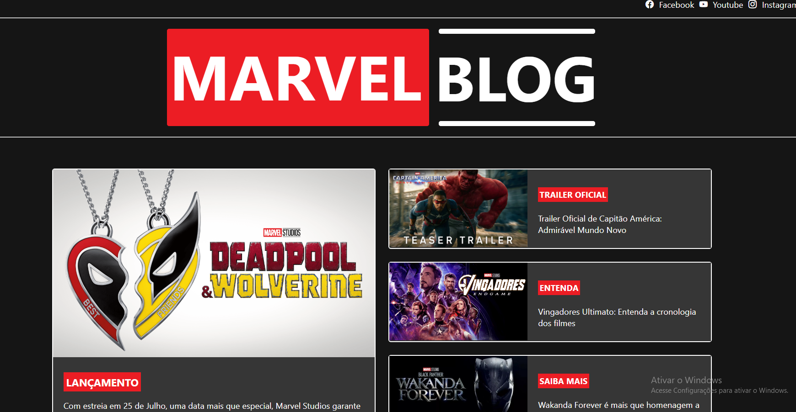

# 🕷️ BLOG MARVEL

Plataforma Angular criada com o intuito de ser um Blog sobre os principais lançamentos de filmes e séries juntamente com novidades do incrível Universo Marvel, tudo em um único lugar!


## 🚀 Ambiente de desenvolvimento

O código fonte se encontra no repositório do Github:

https://github.com/jeancrrg/Blog-Marvel-Angular.git

## 💻 Tecnologias utilizadas

>Html → Linguagem de marcação de Hipertexto

>Scss → Folha de estilo dos componentes

>Typescript → Linguagem de programação

>Angular 18 → Framework

>Node 20.15.1 → Framework

>Npm 10.7.0 → Gerenciador de pacotes do Node

## 📝 Requisitos

>Versão 18 do Angular

>Versão do Node compatível a versão do Angular

## 🛠️ Como rodar o projeto

Ao importar o projeto, antes de subir localmente é necessário instalar as bibliotecas do projeto, para isso basta executar o seguinte comando no terminal:

```properties
npm install
```

Logo após a instalação das bibliotecas basta executar o seguinte comando para subir localmente:

```properties
npm start
```

Feito isso, abra o projeto no navegador:

```properties
http://localhost:4200/
```

## 📌 Sobre a plataforma

A plataforma foi desenvolvida para os amantes do Mundo Marvel que não querem perder nada sobre esse universo imenso cinematográfico. Criada com o intuito de não deixar passar nada, a plataforma dispõe das redes sociais e o site oficial da Marvel, bastante clicar no logo da marvel logo abaixo da plataforma. 


